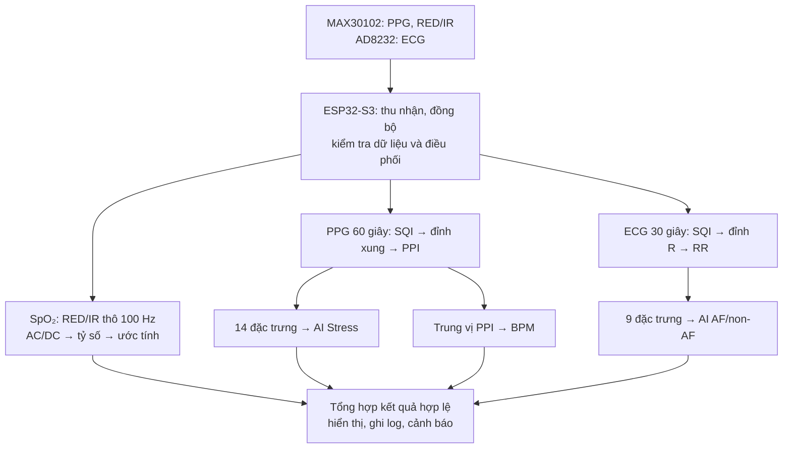

# AI_Moudel_Summary — nguyên mẫu phân tích ECG và PPG

## Firmware tích hợp 0.3.0 — cập nhật 27/09/2026

Firmware đã sửa được đưa vào repo này từ [EdgeAI-PPG-Screening, commit 3f2ec90](https://github.com/Hieuto0409/EdgeAI-PPG-Screening/commit/3f2ec90882ea28f3736e76c63514bb2a27d58162), với các phần tách riêng:

- [`firmware/`](firmware/): firmware thiết bị ESP32-S3, thu PPG 200 Hz / ECG mục tiêu 500 Hz, tích hợp Stress, AF/non-AF và SpO₂.
- [`tin_hieu/`](tin_hieu/): mã xử lý tín hiệu tham khảo độc lập; chưa phải thư viện được liên kết vào firmware tích hợp.
- [`docs/ai-compatibility/REPAIR_REPORT.md`](docs/ai-compatibility/REPAIR_REPORT.md): các sửa đổi, bằng chứng kiểm thử và việc còn phải đo trên bo.

Build và kiểm thử bản tích hợp từ thư mục `firmware/`:

```bash
cd firmware
pio run -e esp32-s3-devkitc-1
pio test -e native
```

Trên Windows có đường dẫn Unicode, dùng `powershell -ExecutionPolicy Bypass -File tools/build_windows.ps1` từ `firmware/`. Bản nguồn này đã có bằng chứng 40/40 native test, bốn profile build thành công và suy luận ECG thật trên máy tính. Chưa kiểm chứng toàn bộ trên bo hoặc có golden ECG độc lập. Xem [bàn giao vào repo này](docs/ai-compatibility/REPOSITORY_HANDOFF.md) để biết nguồn và phạm vi.

Các thư mục `src/`, `include/`, `lib/`, `tools/`, `test/` và `platformio.ini` ở gốc vẫn là bộ module/demo AI hiện có. Nội dung phía dưới mô tả bộ demo đó; trạng thái firmware tích hợp được ghi trong báo cáo mới ở trên.

Project PlatformIO cho **ESP32-S3-DevKitC N16R8**, tập hợp bốn đầu ra nghiên cứu từ hai cảm biến dự kiến: Stress từ PPG, nhịp tim PPG (BPM), AF/non-AF từ ECG và SpO₂ từ tín hiệu RED/IR. Trong đó **Stress và AF/non-AF dùng hai mô hình AI riêng**; **BPM và SpO₂ dùng thuật toán**, không phải mô hình AI.

> **Trạng thái bàn giao:** Mã firmware đã được build trong các môi trường PlatformIO của project; demo offline và các bài kiểm tra đi kèm chạy trên dữ liệu mẫu. Chưa có kết quả chạy toàn bộ luồng thu cảm biến, xử lý tín hiệu và suy luận trên bo ESP32-S3 thật. Không dùng đầu ra của nguyên mẫu để chẩn đoán bệnh.

## 1. Sơ đồ xử lý



Nhánh BPM **tái sử dụng PPI** đã tạo từ đỉnh PPG. Đỉnh xung PPG và đỉnh R ECG là hai loại đỉnh khác nhau. Trên hệ thống cuối, nhóm phụ trách xử lý tín hiệu sẽ cung cấp đầu vào đạt chất lượng cho các module; demo offline hiện tự lọc và tìm lại đỉnh từ CSV thô, đồng thời đọc cờ SQI của gói Step 2.

## 2. Các nhánh và trạng thái thực tế

| Nhánh | Đầu vào và cách tính | Đầu ra | Đã kiểm tra | Việc còn lại |
|---|---|---|---|---|
| **Stress PPG** | Cửa sổ 60 giây → PPI/PRV → 14 đặc trưng đúng thứ tự → chuẩn hóa và hồi quy logistic | `baseline`/`stress`, xác suất và cờ hợp lệ | Suy luận Python và C++ trên dữ liệu offline; demo đọc PPG Step 2 khoảng 25 Hz | Đối chiếu trích xuất đặc trưng khi nối bộ xử lý tín hiệu và MAX30102 thật |
| **BPM từ PPG** | `60.000 / trung vị(PPI hợp lệ tính bằng ms)` | BPM; nhãn nhịp lúc nghỉ chỉ khi xác nhận đúng bối cảnh | Kiểm tra công thức, điều kiện chất lượng và dữ liệu mẫu offline | Nối PPI và SQI từ luồng cảm biến thực |
| **ECG AF/non-AF** | Cửa sổ 30 giây → RR hợp lệ → 9 đặc trưng → mô hình Edge Impulse | Dự kiến `AF`/`non-AF` và xác suất | Đã xác minh thứ tự/đơn vị 9 đặc trưng; demo trích xuất đặc trưng; firmware build được | **Demo chưa chạy suy luận Edge Impulse**; cần nối ECG thật và kiểm tra model trên bo |
| **SpO₂** | RED và IR **thô**, còn DC, 100 Hz → AC/DC mỗi kênh → tỷ số và hiệu chuẩn/tra cứu | SpO₂ (%) và cờ hợp lệ | Replay fixture 100 Hz của module trả 99%, 100%, 99% | Step 2 PPG 25 Hz chưa xác định RED/IR nên **chưa nối vào thuật toán**; cần kiểm tra với cảm biến và thiết bị tham chiếu |

**Lưu ý về thuật ngữ:** PPI/PRV là khoảng giữa các **đỉnh xung PPG** và biến thiên của chúng. RR/HRV trong nhánh ECG lấy từ **đỉnh R**; không coi PRV và HRV là cùng một phép đo.

### Stress PPG: 14 đặc trưng theo thứ tự model

`mean_hr_bpm`, `std_hr_bpm`, `min_hr_bpm`, `max_hr_bpm`, `mean_pp_ms`, `median_pp_ms`, `sdnn_ms`, `rmssd_ms`, `sdsd_ms`, `pnn20_pct`, `pnn50_pct`, `cvnn`, `beat_count`, `valid_rr_ratio`.

`stress_ppg_model.h` nhận **vector 14 đặc trưng**; header này không nhận sóng PPG thô. Mô hình học từ BVP 64 Hz của WESAD. Bộ dữ liệu huấn luyện và dữ liệu Step 2 25 Hz khác cảm biến/tần số; kết quả trên WESAD không đại diện cho độ chính xác của MAX30102.

### ECG: 9 đặc trưng theo thứ tự model

`mean_rr`, `median_rr`, `sdnn`, `rmssd`, `pnn50`, `cv_rr`, `iqr_rr`, `min_rr`, `max_rr`.

Bảy đặc trưng thời gian dùng **giây**; `pnn50` dùng **%**; `cv_rr` không có đơn vị. Thứ tự và đơn vị đã được đối chiếu với dữ liệu huấn luyện ECG và tham số chuẩn hóa của model. Dữ liệu huấn luyện dùng vị trí `.qrs` ở 250 Hz; demo xử lý ECG Step 2 ở khoảng 500 Hz và tự tìm đỉnh R. Việc trích xuất đúng số lượng đặc trưng hoặc build firmware **chưa chứng minh đã suy luận AF/non-AF trên bo**. Mô hình chỉ phân loại hai nhãn này, không phát hiện mọi loại rối loạn nhịp.

## 3. Quy tắc hiển thị tham khảo

Chỉ diễn giải **sau khi đầu ra thuật toán và kiểm tra chất lượng hợp lệ**:

| Chỉ số | Giá trị | Nhãn của nguyên mẫu |
|---|---|---|
| SpO₂ | 95–100% | Trong khoảng tham khảo |
| SpO₂ | 93–94% | Cần chú ý |
| SpO₂ | ≤92% | Cảnh báo SpO₂ thấp |
| SpO₂ | Thiếu dữ liệu, không hữu hạn, ngoài dải hoặc QC lỗi | Chưa có kết quả tin cậy |
| BPM ở **người lớn được xác nhận đang nghỉ** | <60 / 60–100 / >100 BPM | Thấp hơn / Trong / Cao hơn khoảng tham khảo lúc nghỉ |
| BPM khi chưa rõ trạng thái nghỉ | BPM hợp lệ | Hiện số BPM; “Chưa đủ bối cảnh để đánh giá theo nhịp lúc nghỉ” |

Các mốc SpO₂ là **nhãn tham khảo có giới hạn bối cảnh**, không phải chứng nhận một giá trị là “an toàn” cho mọi người. Mốc 93–94% và ≤92% tham khảo hướng dẫn **NHS England COVID Oximetry @home**; người có bệnh phổi, sống ở độ cao hoặc có mục tiêu oxy riêng cần diễn giải theo hướng dẫn phù hợp. Mốc BPM 60–100 áp dụng cho **phần lớn người trưởng thành lúc nghỉ**; vận động, thuốc, giấc ngủ và thể trạng có thể ảnh hưởng nhịp tim. Các nhãn trong project không thay thế đánh giá y tế.

Nguồn: [MedlinePlus — Pulse Oximetry](https://medlineplus.gov/lab-tests/pulse-oximetry/), [NHS England — COVID Oximetry @home](https://www.england.nhs.uk/coronavirus/documents/covid-19-standard-operating-procedure-covid-oximetry-home/), [American Heart Association — All About Heart Rate](https://www.heart.org/en/health-topics/high-blood-pressure/the-facts-about-high-blood-pressure/all-about-heart-rate-pulse).

## 4. Chạy demo và kiểm tra

Mở terminal tại thư mục gốc project (nơi có `platformio.ini`). Cần Python 3, các gói `numpy`, `pandas`, `scipy`, trình biên dịch `g++` trong `PATH` để chạy phần đối chiếu C++/replay; cần PlatformIO CLI nếu muốn build firmware. Công cụ thiếu sẽ được demo báo là bỏ qua, cần đọc **trạng thái từng nhánh** thay vì chỉ nhìn exit code.

```bash
python tools/run_offline_demo.py
python test/test_interpretation_rules.py
python test/test_ppg_heart_rate.py
python test/verify_stress.py
```

Demo in bảng tổng hợp và lưu JSON tại `tools/output/offline_demo_<timestamp>.json`. Kết quả mẫu từng thấy ở gói Step 2: Stress `BASELINE` với xác suất khoảng `0,1984`; nhịp PPG `88,24 BPM` và **chưa đủ bối cảnh đánh giá nhịp lúc nghỉ**. ECG là `NOT_READY` đối với suy luận; SpO₂ là `TEST_FIXTURE` từ bộ replay riêng. Đây là **kết quả mẫu**, không phải giá trị cố định của mọi phiên đo.

Nếu đã cài PlatformIO CLI:

```bash
pio run -e esp32-s3-devkitc-1
pio run -e test_fixture
```

Trên Windows, có thể chạy hai lệnh từ terminal của VS Code/PlatformIO. **Build thành công** xác nhận mã biên dịch/liên kết; không chứng minh cảm biến, model ECG hay cảnh báo đã chạy trên phần cứng.

### Ý nghĩa trạng thái

| Trạng thái | Cách hiểu |
|---|---|
| `RESULT_AVAILABLE` | Thuật toán/model của nhánh đã chạy với dữ liệu offline đủ điều kiện; chưa xác nhận độ chính xác trên thiết bị cuối |
| `TEST_FIXTURE` | Kết quả từ bài test/replay có sẵn của module, độc lập với luồng Step 2 |
| `NOT_READY` | Thiếu điều kiện để đưa ra kết quả của nhánh |
| `QC_REJECTED` | Dữ liệu không vượt qua điều kiện chất lượng |
| `SKIPPED` | Một công cụ hoặc bước kiểm tra không sẵn có trong môi trường chạy |

## 5. Kết quả mô hình Stress trên WESAD

Pipeline đánh giá dùng các cửa sổ **60 giây**, bước **30 giây**, chia theo người: train 11 người/224 cửa sổ; validation 2 người/42 cửa sổ; test 2 người (S13, S16)/60 cửa sổ. Mô hình *evaluation* huấn luyện từ train đạt **56/60 = 93,33%** trên test. Mô hình *deployment* học từ train + validation, hệ số được nhúng để suy luận, hậu kiểm trên cùng test đạt **58/60 = 96,67%**. Dùng **93,33%** khi trình bày kết quả đánh giá chính; hai con số không phải độ chính xác lâm sàng hoặc độ chính xác trên MAX30102.

## 6. Bàn giao tích hợp tiếp theo

1. Nối việc thu MAX30102 và AD8232, đồng bộ thời gian, xử lý mất mẫu và cờ chất lượng trong firmware. Chế độ khởi động mặc định có thể trả `NOT_READY` vì chưa có dữ liệu cảm biến.
2. Chốt ánh xạ LED **RED/IR**, cấp dữ liệu **thô ở 100 Hz có DC** cho SpO₂; không nội suy PPG Step 2 25 Hz thành phép đo 100 Hz hợp lệ.
3. Nối PPI và 14 đặc trưng PPG **đúng định nghĩa, đơn vị, thứ tự** với model Stress; tái sử dụng PPI hợp lệ cho BPM.
4. Nối RR và 9 đặc trưng ECG **đúng thứ tự/đơn vị** với model Edge Impulse; ghi log suy luận AF/non-AF thực trên bo trước khi báo cáo kết quả nhánh này.
5. Chạy kiểm tra trên phần cứng và dữ liệu đo phù hợp; nếu đánh giá độ chính xác SpO₂ thì phải đối chiếu với thiết bị tham chiếu. Ghi riêng kết quả demo, replay, build và kết quả đo thực.

Báo cáo nghiên cứu Word đi kèm project: `Bao_cao_NCKH_tich_hop_PPG_ECG_SpO2_cap_nhat_25092026.docx`. README này là hướng dẫn chạy và bàn giao mã; xem báo cáo để biết cơ sở khoa học, bảng kết quả và giới hạn nghiên cứu chi tiết hơn.
